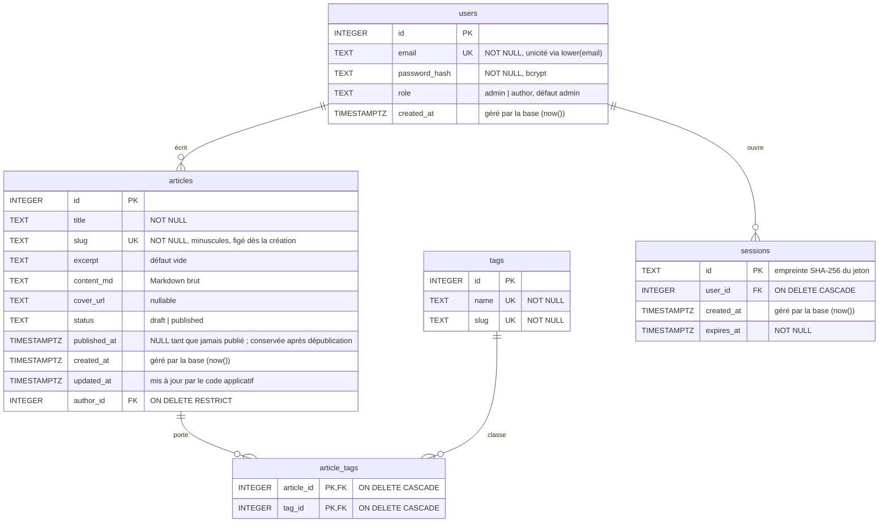

# Base de données

Base PostgreSQL du blog (Neon ou Supabase). Le schéma exécutable est dans `server/migrations/`.

## Diagramme entité-relation

## Relations

| Relation | Cardinalité | Règle de suppression |
|---|---|---|
| `users` → `articles` | 1-N | `RESTRICT` : impossible de supprimer un utilisateur qui a des articles |
| `articles` ↔ `tags` | N-N via `article_tags` | `CASCADE` : supprimer un article ou un tag supprime les liens, jamais l'autre entité |

## Index

| Index | Rôle |
|---|---|
| `articles(slug)` UNIQUE | Retrouver un article depuis son URL |
| `articles(status, published_at DESC)` | Page d'accueil : articles publiés, du plus récent au plus ancien |
| `article_tags(article_id, tag_id)` PK (clé primaire, index automatique) | Tags d'un article |
| `article_tags(tag_id)` | Articles d'un tag (filtre V1.5) |

## Décisions de conception

- **Markdown stocké, HTML généré.** Le contenu est conservé brut. La conversion et la sanitisation ont lieu à l'affichage, ce qui permet de changer le rendu sans migrer les données.
- **`published_at` distinct de `created_at`.** La date affichée est celle de la publication, pas celle du premier brouillon.
- **Slug stable.** Généré à la création, il ne change plus après publication, pour ne pas casser les liens partagés.
- **Contraintes dans la base.** Les `CHECK`, `UNIQUE`, `NOT NULL` et clés étrangères protègent les données même si le code applicatif contient un bug. Exemples : un article publié doit avoir une `published_at`, un slug est toujours en minuscules, et un email est unique sans tenir compte de la casse.
- **Dates en `TIMESTAMPTZ`.** PostgreSQL gère nativement les dates avec fuseau horaire ; on les compare et on les trie sans conversion.
- **Colonne `role` prévue dès la V1** (un seul rôle utilisé) pour éviter une migration lors de l'ajout des auteurs.
- **Sessions hors de ce schéma initial.** Ajoutées dans `002_sessions.sql`.
- **Index fonctionnel sur `lower(email)` plutôt que `CITEXT`.** L'extension `citext` 
  n'est pas disponible sur toutes les images PostgreSQL. On utilise à la place un 
  index `UNIQUE` sur `lower(email)`,  sans dépendance d'extension.
